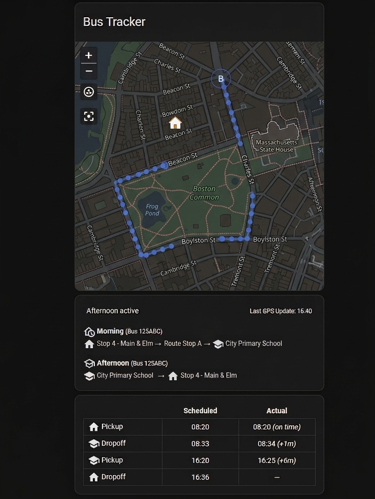

# Stopfinder Bus Tracker

> **⚠️ Unofficial API** — Transfinder endpoints are undocumented and may break without notice.

HACS integration for tracking school buses via the Transfinder Stopfinder app.

## Installation

1. HACS → Integrations → ⋮ → Custom repositories → add `https://github.com/steveredden/ha_stopfinder` (Integration)
2. Install **Stopfinder**, restart HA
3. Settings → Devices & Services → Add Integration → **Stopfinder**

Enter your Stopfinder credentials. One device is created per bus number on the account.

## Entities

For bus `123`:

| Entity | Description |
|---|---|
| `device_tracker.bus_123` | Live GPS during active window |
| `sensor.bus_123_home_pickup` | Scheduled morning pickup |
| `sensor.bus_123_school_dropoff` | Scheduled school dropoff |
| `sensor.bus_123_school_pickup` | Scheduled afternoon pickup |
| `sensor.bus_123_home_dropoff` | Scheduled home dropoff |
| `sensor.bus_123_*_actual` | Actual timestamps, auto-stamped on arrival |

Tracking windows come from the API schedule (`startTime`/`finishTime`).

## Dashboards

<!-- markdownlint-disable MD033 -->
A starter dashboard YAML (map + schedule/actual tables) is at <a href="docs/dashboard-example1.yaml" target="_blank">docs/dashboard-example1.yaml</a>. Replace <code>BUS_NUMBER</code> and import via the HA Raw Configuration Editor.

### Other contributions

* <a href="docs/dashboard-example2.yaml" target="_blank">docs/dashboard-example2.yaml</a> by @bdstephenson3

<!-- markdownlint-enable MD033 -->
### card_mod

[card_mod](https://github.com/thomasloven/lovelace-card-mod) is recommended, and the dashboard has currently-commented-out the recommended stylizations.  If you use [card_mod](https://github.com/thomasloven/lovelace-card-mod), uncomment to style the dashboard.

## License

[MIT](LICENSE)
